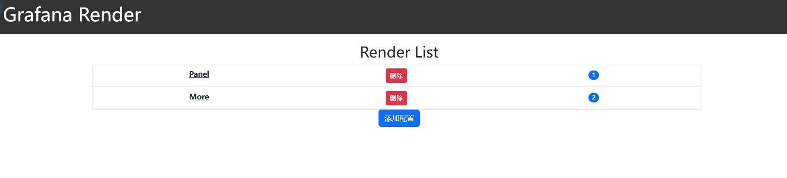
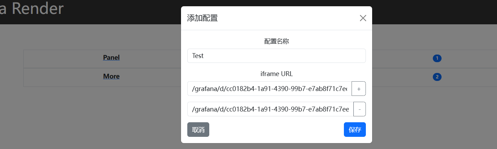
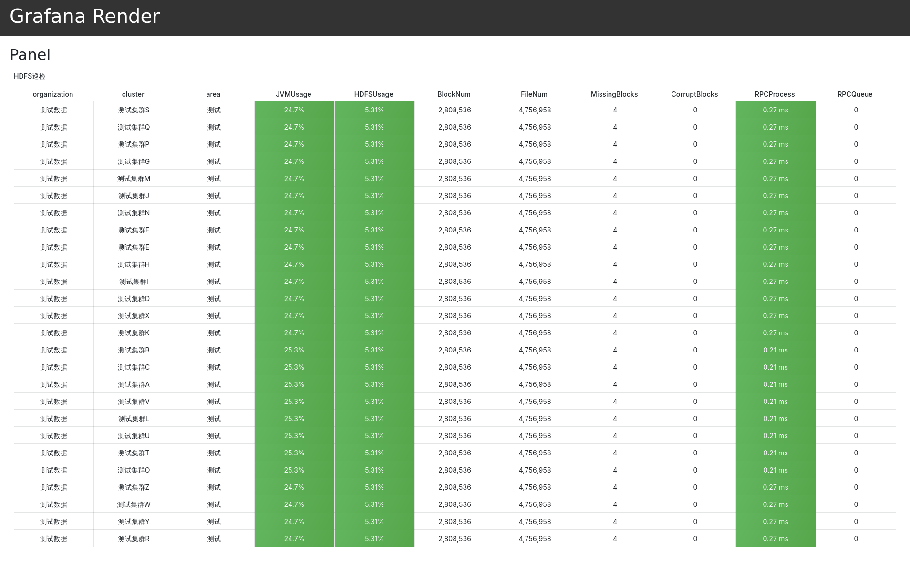
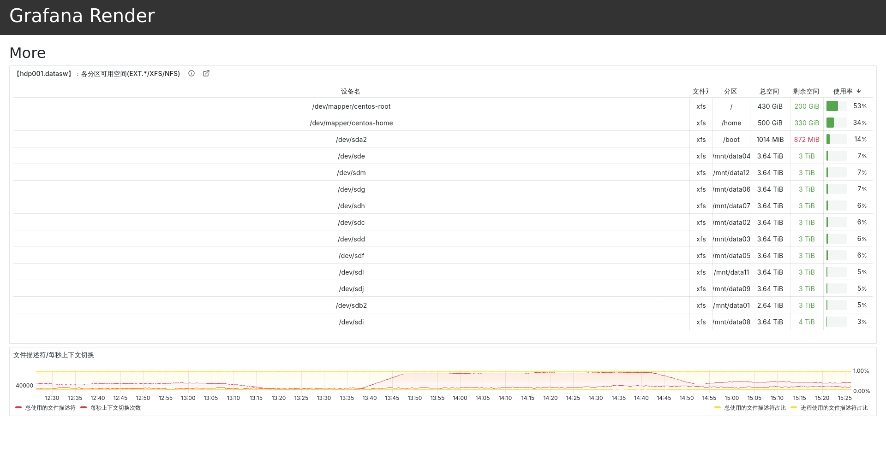
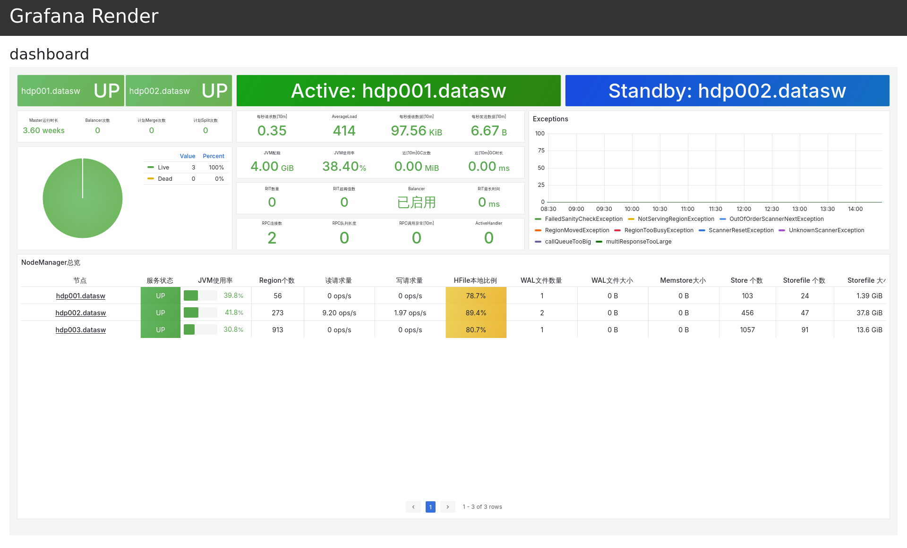
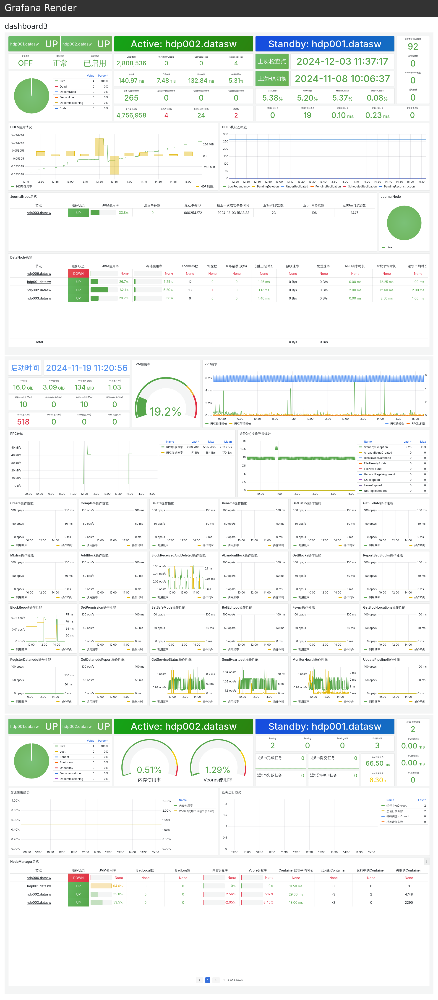

# Grafana Screenshot

## 背景

自用的方便进行Grafana截图的小工具，主要是Grafana本身提供的render不好用，一方面加载慢，另一方面部署的时候有各种问题

另外就是我这边会有针对单个panel或者多个dashboard进行完整截图的需求（比如完整报表方便导PDF，或者是），所以自己写个小工具方便实用。

## 功能

- 基于flask嵌入Grafana的页面，可以嵌入panel也可以嵌入整个dashboard
- 基于selenium+firefox进行截图

## 依赖

都是于下面的环境做的，如果用其他环境可能会有不兼容的情况

- selenium
- python3
- Ubuntu
- Firefox - Chrome浏览器截全屏有限制，所以用firefox

## 快速开始


### Grafana 配置

允许通过iframe嵌入，所以需要配置一下grafana，允许跨域访问以及匿名访问，参考配置：

```ini
root_url = %(protocol)s://%(domain)s:%(http_port)s/grafana
serve_from_sub_path = true
allowed_origins = *
allow_embedding = true

[auth.anonymous]
enabled = true
```

### nginx代理
因为要在iframe中执行js，所以需要用Nginx解决跨域问题，把grafana和后端代理到一个域下面，参考配置：

```conf
server {
    listen 8040;
    # 后端
    location / {
       proxy_pass http://127.0.0.1:5000;
       add_header 'Access-Control-Allow-Origin' '*';
       add_header Access-Control-Allow-Methods GET,POST,OPTIONS,DELETE;
       proxy_set_header X-Real-IP $remote_addr;
       proxy_set_header   Host $host;
    }
    # Grafana
    location /grafana {
        proxy_pass http://10.0.0.1:3000/grafana;
        add_header 'Access-Control-Allow-Origin' '*';
        add_header Access-Control-Allow-Methods GET,POST,OPTIONS,DELETE;
        proxy_set_header X-Real-IP $remote_addr;
        proxy_set_header   Host $host;
    }
}
```


### 安装Firefox

参考官网安装firefox二进制文件

[Firefox安装教程](https://support.mozilla.org/zh-CN/kb/install-firefox-linux)

准备geckodriver，直接从github上面下载解压好：

[geckodriver](https://github.com/mozilla/geckodriver/releases)

解压即用

### 项目启动

**后端**

本项目使用uv做管理，安装方式参考: [uv](https://github.com/astral-sh/uv)

安装项目依赖：

```bash
uv sync
```

启动项目：

```bash
python app.py
```

nginx代理完成后从浏览器访问

## 界面





## 截图样例

**单个Panel**


**多个Panel**


**单个Dashboard**



**多个Dashboard**
